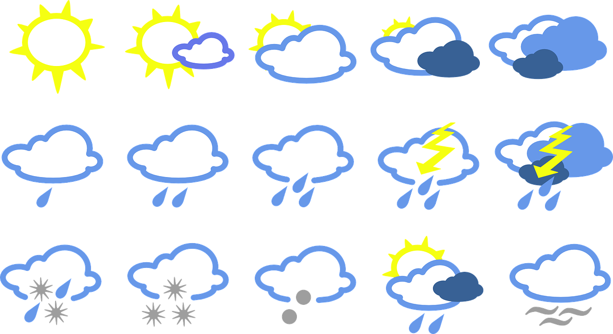

# Raspberry-Pi-Weather-Station
> Bassed on Raspberry Pi Weather Station with Camera Module to recognize sky condition

## Table of contents
* [General info](#general-info)
* [Screenshots](#screenshots)
* [Used parts](#used-parts)
* [Technologies](#technologies)
* [Setup](#setup)
* [Features](#features)
* [Status](#status)
* [Inspiration](#inspiration)
* [Contact](#contact)

## General info
Simple Weather Station bassed on Raspberry Pi Computer with two sensors and Offical Raspberry Pi Camera Module V2.

## Screenshots


## Used parts
For the purpose of this project I use:
* Raspberry Pi Zero W WH/Raspberry Pi 3B+
* BME280 I2C/SPI 3,3V Temperature Humidity Pressure Sensor
* Waterproof 1-Wire DS18B20 Compatible Digital temperature sensor
* Pi Camera Module v2 8MPx
* Breadboard PCB 
* Jumper wires
* 4.7k resistor
* optional Pimoroni Enviro pHat
	
## Technologies
Project is created with technologies:
* Python 3.X scripts
* Bash scripts
* OpenCV 4
* MariaDB DataBase
* Grafana
	
## Setup
Download the project files by runing this command:
```
git clone https://github.com/Sebastiss/Raspberry-Pi-Weather-Station.git
```
To run this project follow the instruciotns belllow:
1. Make sure that you runing the latest verion of Raspberry Pi OS System
⋅⋅⋅RUn the following line to check the updates:
```
sudo apt update && sudo apt full-upgrade -y
```
2. Install the camera module.
⋅⋅⋅Use instructions from offical [Raspberry Pi Documentation](https://www.raspberrypi.org/documentation/configuration/camera.md)
2.1. If you connect the Raspberry Pi correctly you can run some simple test to check that your system is up and runing smoothly.
⋅⋅⋅Go to test direcotry in download project:
```
cd $HOME/Raspberry-Pi-Weather-Station/tests
```
⋅⋅⋅and try runing the following script
```
python3 time-lapse.py
```
3. Next step will be run the following bash script from repository to downlaod all necessary librarys and dependencies for OpenCV
⋅⋅⋅Go to the scirpts directory and run the following script
```
./installOpenCV.sh
```
⋅⋅⋅If the file is not executable try this comand first
```
sudo chmod +x installOpenCV.sh
```
⋅⋅⋅then try again run the script
4. When everyting is install try run another test scirpts form this repository:
```
python3 test-opencv.py
```
⋅⋅⋅To shutdown this script just press any key on a keyboard.
⋅⋅⋅You can try run another test script with inverted pallet collors:
```
python3 bgrTOhsv.py
```
5. Install the MariaDB Data Base server and drivers to communicate with them:
```
sudo apt-get install mariadb-server
sudo apt-get install python-mysqldb
pip3 install mariadb
```
5.1. After installation process try get to the MariaDB by typing the following command:
```
sudo mysql --user=root
```
5.2. Create new user for this project purpose I create the user ```admin``` identified by password ```admin```
```
CREATE USER 'admin'@'localhost' IDENTIFIED BY 'admin';
```
5.3. Add new user privileges
```
GRANT ALL PRIVILEGES ON *.* TO 'admin'@'localhost';
```
5.4. Exit the MariaDB termianl by typing ```exit;``` adn try login as a new user:
```
mariadb -u admin -p
```
5.5. The system schould ask you to enter the password. When you type a password know letters/starts schould be visible.

, install it locally using npm:

```
Setup my project is in progress
```

## Features
List of features which I want to develop
To-do list:
* Recognition by the image she condition
* Read data from the sensors
* Represnets stored data on a web-site
* Get notification about sky condtion
* Sky image recognition using OpenCV and RPi Camera Module
* Read and store data form the sensors in database


## Status
Project is: _finished_

## Inspiration
My project is inspired by Christopher Barnatt and his projects about Weather Station [Link to the Video](https://www.youtube.com/watch?v=ChQpD2gsC20)
